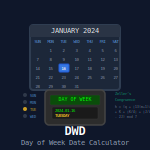

# hp-41_dwd

[](https://en.wikipedia.org/wiki/HP-41C)
[](https://unlicense.org/)
[](https://github.com/isene/hp-41_dwd/stargazers)
[](https://isene.org)



## HP-41: Simple date-to-weeknumber-to-date converter

**NOTE:** This program is part of the ISENE.ROM (https://github.com/isene/hp-41_isene-rom). The FOCAL listing can be found in the "src" folder of that project. Any updates and new version will be found there.

The program converts a date to the ISO week number and a week number to the starting date of that week (monday as specified by ISO). It takes the date in any of the HP-41 formats. The week number to be converted to the date (monday) can be WW for the current year or WW,YYYY for any year.

The program is actually two programs in one; the D-W and the W-D.

Examples:

```
Enter (in DMY mode):

2,012006
XEQ'D-W

and you get:

1

Enter (in MDY mode):

11,2007
XEQ'W-D

and you get:

3,122007

Enter (in MDY mode):

11
XEQ'W-D

and you get:

3,132006

## License
This software is released into the Public Domain.
```
